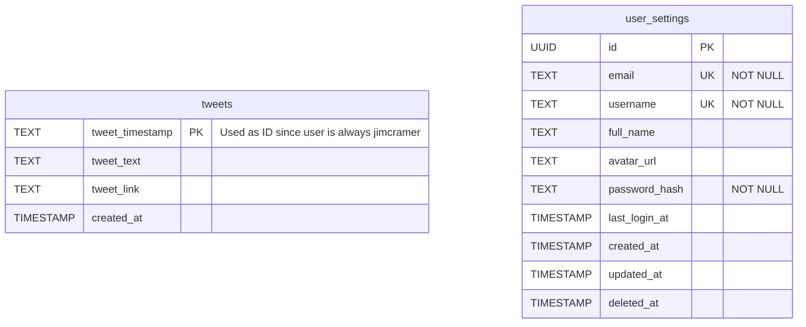

# Database Implementation Plan (Supabase)

## Goal
Implement a persistent database using Supabase to store scraped tweets, their generated signals, and user configurations. This ensures data survives between scraping cycles and prevents duplicate processing.

## Sub-Issues Addressed
1. **#36 Create tweets table**: Store tweets and their analysis signals.
2. **#37 Create user_settings table**: Store API keys and configuration.
3. **#38 Configure Supabase client in the backend**: Setup connection and client instantiation.
4. **#39 Add uniqueness constraint to prevent duplicates**: DB-level duplicate prevention.

---

## 1. Database Schema (Supabase SQL)

### Entity Relationship Diagram

